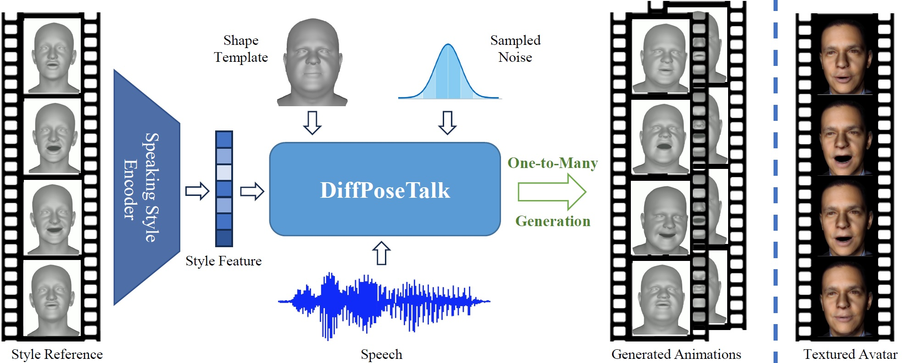

# DiffPoseTalk

<a href='https://arxiv.org/abs/2310.00434/'></a>
<a href='https://raineggplant.github.io/DiffPoseTalk/'></a>

DiffPoseTalk: Speech-Driven Stylistic 3D Facial Animation and Head Pose Generation via Diffusion Models



---

## TODO

- [x] Release the TFHP dataset
  - [x] Release the processed lmdb dataset
  - [x] Release the raw dataset
- [x] Release the training and inference code
- [x] Release the pretrained models
- [x] Release the data processing code


## Setup

- Download FLAME-related files following this [instruction](./models/data/README.md) and setup the enviornments. You can easily do this by running the following commands:
  ```shell
  bash ./setup/fetch_data.sh
  bash ./install_conda.sh
  ```
- (Optional) If you want to train with the `HDTF_TFHP`, please follow this [instruction](./datasets/HDTF_TFHP/README.md) to download the processed dataset.


## Inference

We provide two sets of [pretrained models](https://drive.google.com/drive/folders/1pOwtK95u8O1qG_CiRdD8YcvuKSlFEk-b?usp=sharing) for inference. One predicts head motion and the other does not. The DiffPoseTalk system takes a speech clip, a template face shape parameter, and a style feature as input, and outputs diverse and stylistic lip-synced animations.

| Set  | Style Encoder              | Denosing Network          | Head Motion? |
| ---- | -------------------------- | ------------------------- | ------------ |
| 1    | head-L4H4-T0.1-BS32 (@26k) | head-SA-hubert-WM (@110k) | ✅            |
| 2    | L4H4-T0.1-BS32 (@34k)      | SA-hubert-WM (@100k)      | ❌            |


### 1. Extract Style Features

The style encoder can extract a style feature from an arbitray four-second motion sequence:

```shell
python extract_style.py --exp_name <STYLE_ENC_NAME> --iter <STYLE_ENC_ITER> -c <FLAME_MOTION_SEQ> -o <OUTPUT_NAME> -s <STARTING_FRAME>
```
Note that the `<FLAME_MOTION_SEQ>` should be a `.npz` file that has the `exp` and `pose` keys. The extracted style feature will be saved under the corresponding folder (`<STYLE_ENC_NAME>/<STYLE_ENC_ITER>`) under `demo/input/style`.

We have also provided some feature examples for the pretrained models.

### 2. Generate Speech-Driven Animations

```shell
python demo.py --exp_name <DENOISING_NETWORK_NAME> --iter <DENOISING_NETWORK_ITER> -a <AUDIO> -c <SHAPE_TEMPLATE> -s <STYLE_FEATURE> -o <OUTPUT>.mp4 -n <N_REPITIONS> -ss <CFG_SCALE_FOR_STYLE> -sa <CFG_SCALE_FOR_AUDIO>
```

The `<SHAPE_TEMPLATE>` should be a `.npy` file containing a frame of shape parameter. The `<STYLE_ENC_NAME>/<STYLE_ENC_ITER>` in `<STYLE_FEATURE>`'s path can be omitted. 

You can also pass `--dtr 0.99` to enable dynamic thresholding to obtain results with better quality but lower diversity. 

Here are some examples:

```shell
python demo.py --exp_name head-SA-hubert-WM --iter 110000 -a demo/input/audio/FAST.flac -c demo/input/coef/TH217.npy -s demo/input/style/TH217.npy -o TH217-FAST-TH217.mp4 -n 3 -ss 3 -sa 1.15 -dtr 0.99
python demo.py --exp_name SA-hubert-WM --iter 100000 -a demo/input/audio/further_divide_our.flac -c demo/input/coef/TH050.npy -s demo/input/style/normal.npy -o TH050-further-normal.mp4 -n 3 -ss 3 -sa 1.15
```

## Training

Please note:
- The DiffPoseTalk system consists of a style encoder and a denoising network. You will need to train them one by one.
- To optimize I/O performance, we use `lmdb` to pack and handle the training data. Read ["Preparing Your Dataset"](#preparing-your-dataset) to see how to generate your own lmdb dataset.

### 1. Train the Style Encoder

```shell
python main_se.py --exp_name <STYLE_ENC_NAME> --data_root <DATA_ROOT> [--no_head_pose]
```
The style encoder will be saved under the `experiments/SE/<STYLE_ENC_NAME>` folder. View the validation results in the TensorBoard to select the best model.

### 2. Train the Denoising Network

You will need to specify the path to the style encoder checkpoint using the `--style_enc_ckpt` argument. You can also experiment with different argument values and combinations.

```shell
python main_dpt.py --exp_name <DENOISING_NETWORK_NAME> --data_root <DATA_ROOT> --use_indicator --scheduler Warmup --audio_model hubert --style_enc_ckpt <PATH_TO_STYLE_ENC_CKPT> [--no_head_pose]
```

The denoising network will be saved under the `experiments/DPT/<exp_name>` folder. 

## Preparing Your Dataset

Please see the [`scripts_for_dataset`](./scripts_for_dataset/) folder.

---

## Citation

```bibtex
@article{sun2024diffposetalk,
  title={DiffPoseTalk: Speech-Driven Stylistic 3D Facial Animation and Head Pose Generation via Diffusion Models},
  author={Sun, Zhiyao and Lv, Tian and Ye, Sheng and Lin, Matthieu and Sheng, Jenny and Wen, Yu-Hui and Yu, Minjing and Liu, Yong-Jin},
  doi={10.1145/3658221},
  journal={ACM Transactions on Graphics (TOG)},
  volume={43},
  number={4},
  articleno={46},
  numpages={9},
  year={2024},
  publisher={ACM New York, NY, USA}
}
```
